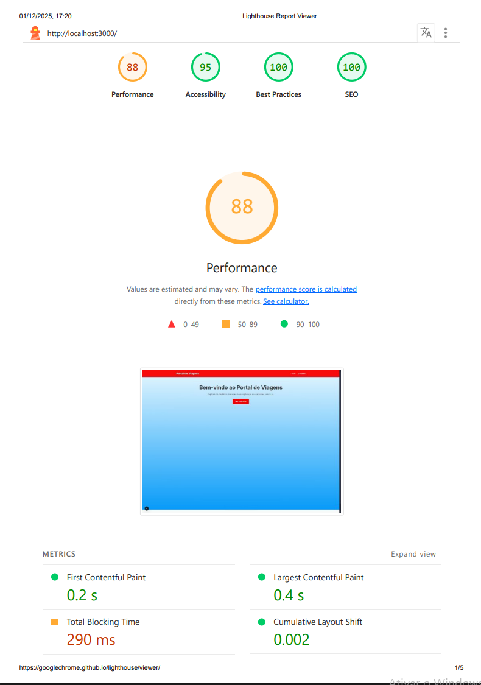
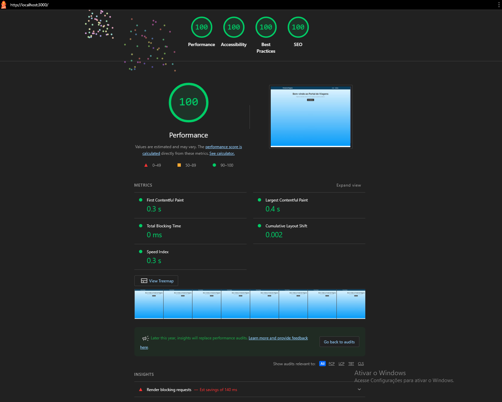

# ✈️ Portal de Viagens  /  Atualização do projeto

Um portal simples e moderno para visualização de destinos turísticos, construído com as tecnologias mais recentes do ecossistema React, incluindo Next.js e TypeScript.  

Este projeto foi desenvolvido como um exercício prático para demonstrar a criação de um site com múltiplas páginas, rotas dinâmicas, componentes reutilizáveis e estilização moderna.  

---

## ✨ Funcionalidades

-   **Página Inicial:** Apresentação breve do portal com um link de chamada para a ação.  
-   **Listagem de Destinos:** Uma página que exibe todos os destinos disponíveis em um layout de grade.  
-   **Páginas de Detalhes Dinâmicas:** Cada destino possui sua própria página com informações detalhadas (descrição, atrações), gerada estaticamente para máxima performance.  
-   **Layout Consistente:** Header e Footer reutilizáveis em todas as páginas.  
-   **Navegação Otimizada:** Transições rápidas entre páginas utilizando o `next/link`.  
-   **Estilização Modular:** Componentes estilizados de forma isolada com CSS Modules.  

---

## 🛠️ Tecnologias Utilizadas

-   **Framework:** Next.js (com App Router)
-   **Linguagem:** TypeScript
-   **Biblioteca de UI:** React
-   **Estilização:** CSS Modules  

## Problemas identificados:  

  

-  **Delay de carregamento das páginas   
-  **Travamentos durantes interações com links e botões  
-  **Baixo contraste nos links do header (Início, Destinos)
-  **Imagens em JPG necessitando de conversão para Webp  

## Após resolução dos problemas:  

  

- **Criei src/data/destinos.ts para organizar o código, permitir reuso dos dados e evitar erros do Next.js ao exportar variáveis dentro de páginas.  
- **Criei um arquivo central de variáveis CSS, com o seguinte objetivo:  
- Centralizar estilos que eram repetidos.  
- Padronizar cores, tipografia e espaçamentos.  
- Facilitar manutenção e futuras alterações visuais.  
- **Imagens convertidas para Webp.
